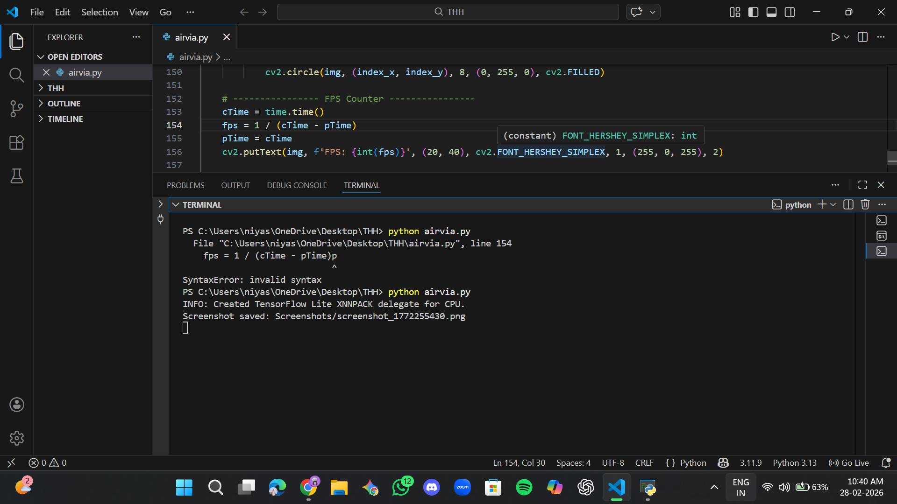
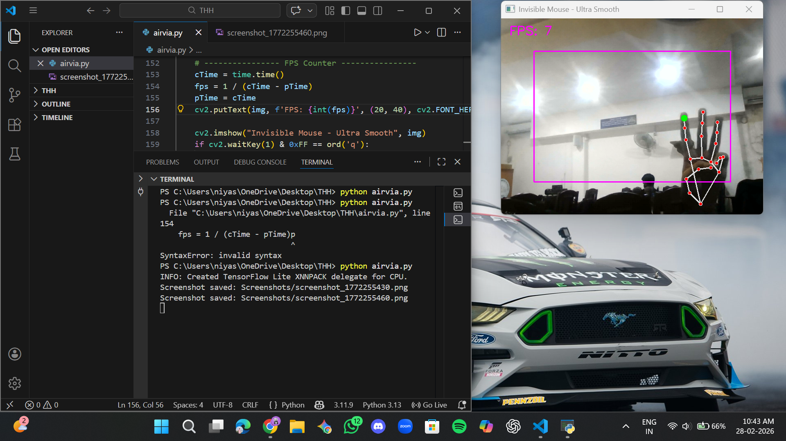
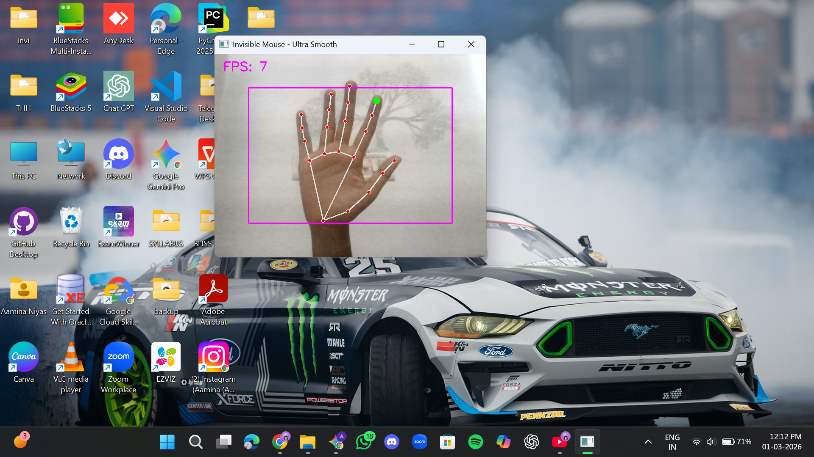

<p align="center">
  
</p>

# Airvia: Invisible Mouse 🎯

## Basic Details

### Team Name: BuildHer

### Team Members
- **Aamina N** - College of Engineering, Perumon
- **Farzana M** - College of Engineering, Perumon

### Hosted Project Link
[Access the GitHub Repository & Releases here](https://github.com/niyas-airvia/airvia-invisible-mouse)

### Project Description
Airvia is an AI-powered, gesture-based control system that transforms a standard webcam into a high-precision input device. By leveraging computer vision, it allows for touch-free navigation, media control, and system shortcuts, creating a seamless "Minority Report" style interface.

### The Problem statement
Traditional computer interaction relies on physical devices (mouse/keyboard), which can be inaccessible for people with motor impairments or inconvenient in sterile/hands-busy environments like kitchens or medical labs.

### The Solution
We use MediaPipe and OpenCV to track 21 3D hand landmarks in real-time. These landmarks are mapped to specific OS-level events via Python, allowing the user to control their PC without ever touching a surface.

---

## Technical Details

### Technologies/Components Used

**For Software:**
- **Languages used:** Python 3.11
- **Frameworks used:** MediaPipe (Hand Tracking Engine)
- **Libraries used:** - `OpenCV`: Image processing and camera feed.
  - `PyAutoGUI`: Mouse and keyboard automation.
  - `Pycaw`: System volume control.
  - `NumPy`: Coordinate mapping and smoothing.
- **Tools used:** VS Code, Git, Auto-py-to-exe.

---

## Features

- **Cursor Movement:** Point and move with the Index Finger.
- **Left Click:** Pinch Thumb + Index finger.
- **Right Click:** Pinch three fingers (Thumb, Index, Middle).
- **Scroll:** Fold four fingers (excluding thumb) and move hand up/down.
- **Screenshot:** Raise three middle fingers (Index, Middle, Ring).
- **Volume Control:** Adjust volume by varying the distance of the Thumb + Index pinch.

---

## Implementation

### For Software:

#### Installation
```bash
pip install mediapipe opencv-python pyautogui numpy pycaw comtypes
```
#### Run
```bash
python airvia.py
```

## Project Documentation

### For Software:

#### Screenshots (Add at least 3)


*screenshot saved shown in terminal*


*screenshot and the three finger raise gesture*


*The hand gesture detection*

#### Diagrams

**System Architecture:**


# AIRVIA – Architecture Explanation

## 1️⃣ Input Layer – Camera Capture
- The webcam captures real-time video frames.
- Each frame is continuously sent to the processing module.

## 2️⃣ Frame Processing – OpenCV
- OpenCV reads the video frames.
- Frames are flipped for mirror view.
- Converted from BGR to RGB (required for MediaPipe).
- Prepares the image for hand detection.

## 3️⃣ Hand Detection – MediaPipe
- MediaPipe Hands detects:
  - Presence of a hand
  - 21 hand landmarks (finger joints)
- Provides precise X and Y coordinates of fingers.

## 4️⃣ Gesture Recognition Logic
- The system calculates:
  - Distance between fingers (e.g., thumb & index for volume)
  - Which fingers are raised
- Based on conditions, gestures are identified:
  - Index finger → Cursor movement
  - Index + Middle → Click
  - Three fingers → Screenshot
  - Thumb + Index distance → Volume control

## 5️⃣ Action Execution Layer
- PyAutoGUI:
  - Move cursor
  - Click
  - Scroll
  - Take screenshot
- Pycaw:
  - Control system volume

## 6️⃣ Output Layer – System Response
- The computer performs the requested action:
  - Cursor moves
  - Click occurs
  - Screenshot is saved
  - Volume changes

---

## Overall Flow

**Camera → OpenCV → MediaPipe → Gesture Logic → PyAutoGUI/Pycaw → System Action**

## Project Demo

### Video
[https://drive.google.com/drive/folders/15sViiKPNxZlQrPew5Od7Bl0RMmIPizOA?usp=drive_link]

**Human Contributions:**
- Architecture design and system planning
- Custom gesture recognition logic implementation
- Integration of MediaPipe with OS-level controls
- Testing, debugging, and performance optimization
- UI/UX gesture design and interaction decisions

*Note: Proper documentation of AI usage demonstrates transparency and earns bonus points in evaluation!*

---

## Team Contributions

- **Aamina N:** Gesture logic development, system integration, debugging, documentation  
- **Farzana M:** Feature implementation, testing, UI interaction design, presentation  

---

## License

This project is licensed under the MIT License – see the [LICENSE](LICENSE) file for details.

---

Made with ❤️ at TinkerHub
